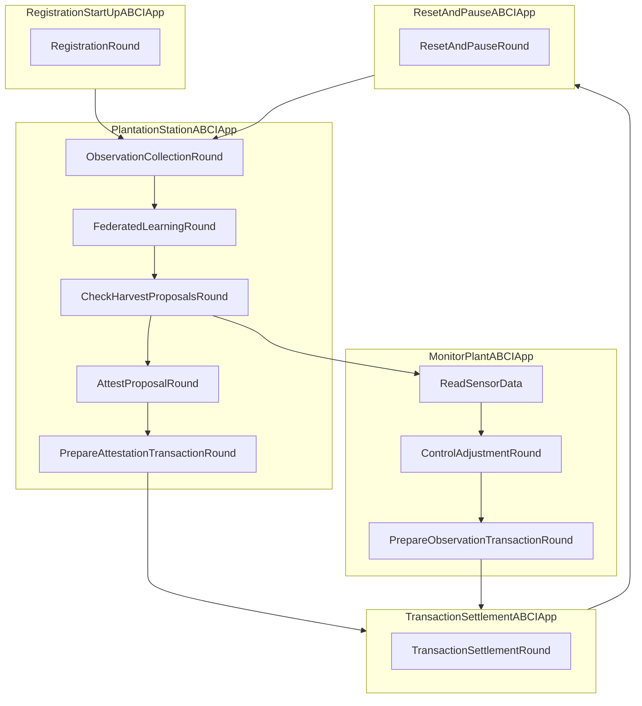

# PlantationStationAbciApp

The ABCIApp is a finite state machine (FSM) in which agents enact an associated behaviour involving data collection or computation. State transitions in the FSM require consensus to be achieved on the outcome of the round, where the necessary conditions can be tailored to suit the output requirements of each state in the application. The GrowthRateOptimizationABCIApp needs to be designed and implemented, the agent registration, transaction settlement and reset and pause ABCI apps are existing components that we can reuse to compose our final ABCIApp.

