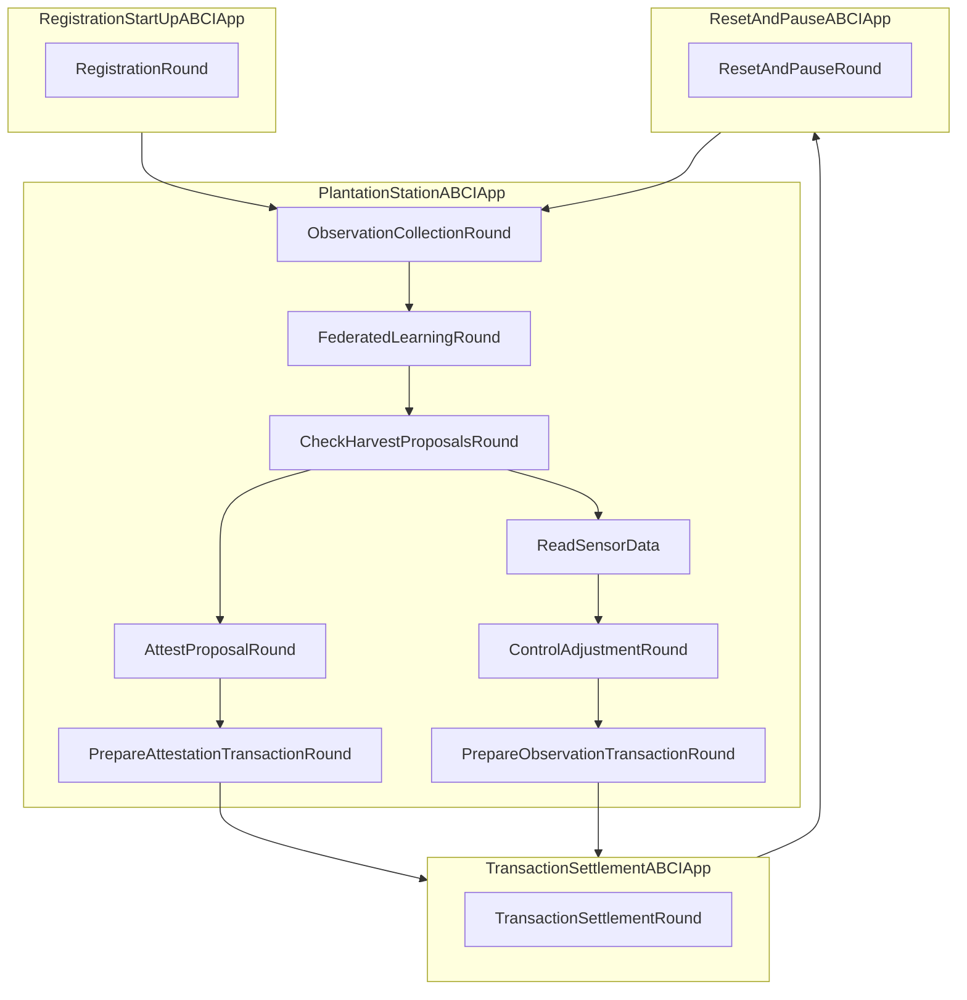

# PlantationStationAbciApp

The ABCIApp is a finite state machine (FSM) in which agents enact an associated behaviour involving data collection or computation. State transitions in the FSM require consensus to be achieved on the outcome of the round, where the necessary conditions can be tailored to suit the output requirements of each state in the application. The `PlantationStationABCIApp` needs to be designed and implemented, the [agent registration](https://github.com/valory-xyz/open-autonomy/blob/main/packages/valory/skills/registration_abci/rounds.py#L116-L163), [transaction settlement](https://github.com/valory-xyz/open-autonomy/blob/9588721267a2a86250f553704da72f12deb0d16e/packages/valory/skills/transaction_settlement_abci/rounds.py#L637-L820) and [reset and pause](https://github.com/valory-xyz/open-autonomy/blob/9588721267a2a86250f553704da72f12deb0d16e/packages/valory/skills/reset_pause_abci/rounds.py#L71-L115) ABCI apps are existing components that we can reuse to compose our final ABCIApp.

