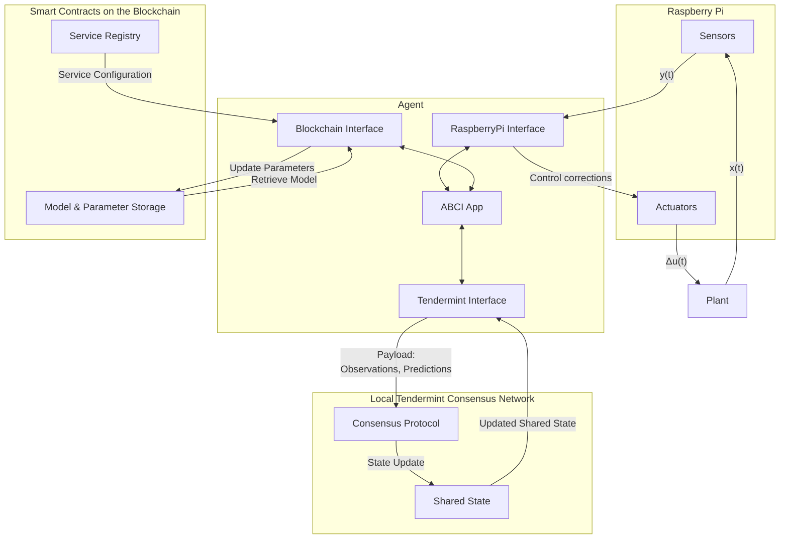

# Systems Diagram

the service configuration is defined on and retrieved from the blockchain. Code required to become an agent operator can be retrieved through IPFS using the hash referenced in the service registry contract. The operators of the service may also be defined on-chain in case permissioned access is desired. The model, its parameters, and the feedback controller are stored on-chain and retrieved for initialization. Computations involving data collection, parameter optimization, and control corrections are performed off-chain in the [ABCIApp](abci_app.md). 

